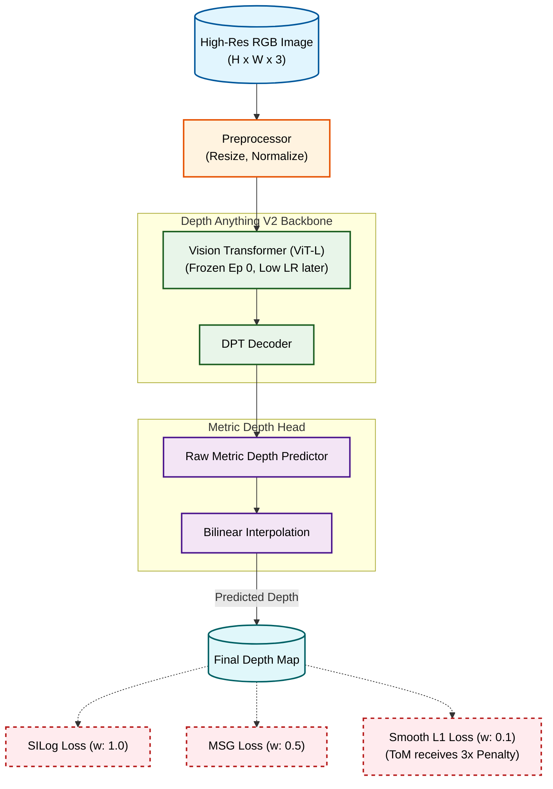

# This repo contains the hello_w team's solution to the NTIRE HR Depth-Mono Challenge 2026

The official DepthAnything implementation **[GitHub](https://github.com/LiheYoung/Depth-Anything.git)**. 

#### Divyavardhan Singh, Hammad Mohammad, Hariom Thacker, Kishor Upla, Kiran Raja
> The challenge aimed to estimate high-resolution depth maps from stereo or monocular images containing Transparent or Mirror (ToM) surfaces.

## Quick Links

*   **[Pre-Trained Fine-Tuned Checkpoints](https://drive.google.com/file/d/1DdHgyH8EvUapcacQfqX7ENlUjLn8sU3j/view?usp=drive_link)**
*   **[Depth Results](https://drive.google.com/file/d/1S25T2b6PWIwrOlOZcVOu3rQ0QUJg6qyf/view?usp=drive_link)**

---
## Architecture Pipeline

Our pipeline adapts the strong zero-shot foundation of **Depth Anything V2 (ViT-L)**. It combats specular reflections by computing multi-scale gradient constraints strictly against boundaries labeled as ToM objects.



## Installation

```bash
cd NTIRE-HR_Depth-DVision
python3 -m venv venv
source venv/bin/activate
pip install -r requirements.txt
```
---
## Test Data

The test dataset can be downloaded from:
**[Test Dataset](https://onedrive.live.com/?redeem=aHR0cHM6Ly8xZHJ2Lm1zL3UvcyFBZ1Y0OUQxWjZybUdnWTFRWWRqVlR0OWpZV0FubHc%5FZT0xdm05YkQ&cid=86B9EA593DF47805&id=86B9EA593DF47805%2118128&parId=86B9EA593DF47805%2118122&o=OneUp)**

### Steps to Download & Unzip

* Download the dataset and save the zip file.

* Unzip into the `dataset/` folder inside the repo:

#### Windows (PowerShell)
```powershell
# Run from the repo root
Expand-Archive -Path "$HOME\Downloads\test_mono_nogt.zip" -DestinationPath ".\dataset\"
```
#### Linux / macOS
```bash
# Run from the repo root
unzip ~/Downloads/test_mono_nogt.zip -d dataset/
```
---
## Test file creation

Change the path in ``dataset_dir`` to the directory having the testing dataset. 

For Example: ``dataset_dir = "./dataset/test_mono_nogt"``

* Note: Directory structure should be same as of test_mono_nogt.

```bash
python dataset_paths.py 
```

The ``test.txt`` file corresponding to the test dataset will be created in ``dataset_paths`` folder. Pass this ``test.txt`` file path to ``img-path`` argument of ``inference`` command. 

The test dataset must be present in the dataset folder. 

A sample test.txt file is already present in dataset_paths


## Inference
```bash
python run.py
```
### Arguments:
#### Input/Output:

``--img-path``: Point it to an image directory storing all interested images, a single image, or a text file storing all image paths.

``-p``: Path to model checkpoints (Present in checkpoints_new folder).

``--outdir``: Path to the directory to save the output depths.

``-width``: Force output width. Default: use the original image width.

``-height``: Force output height. Default: use the original image height.

``--grayscale``: Set to save the grayscale depth map. Without it, a color palette is applied by default.

#### Model & Processing:

``--encoder``: DAV2 encoder size (choices: vits, vitb, vitl). Must match training. Default: vitl (335M).

``--max_depth``: Max depth used during training in meters (must match train.py). Default: 20.0 (for Booster indoor).

``--scene_max_cm``: Realistic max scene depth in cm for Hugging Face output rescaling. Increase if PNG looks too dark; decrease if too bright. Default: 200.0. (Has no effect when using native metric DAV2).

``--invert``: Force depth inversion. Auto-applied for HF backend, but use this flag if native DAV2 output also looks inverted.

``--input_size``: Spatial size fed to DAV2 (must be divisible by 14). Default: 518.

#### Speed & Optimization:

``--no_tta``: Disable Test-Time Augmentation. Makes processing 3× faster with slightly lower accuracy.

``--no_amp``: Disable AMP float16. Use this if you get NaN errors on older GPUs. 

## Training dataset creation

```bash
python dataset_creation.py --dataset_txt ./dataset_paths/train_data.txt
```
### Arguments:
- ``--dataset_txt``: path to dataset txt having format <image_path.png> <depth_path.npy> <mask_path.png>
- ``--save_dir``: dir path to save the patched dataset

Output:
The dataset will be created in the dataset/train folder. 

A train_extended.txt file will be created in dataset_paths having paths of the patched dataset. 

Pass this text file in the ``train_txt`` argument of the training command


## Training

To start training with the default settings:
```bash
python train.py --train_txt dataset_paths/train_extended.txt
```
### Arguments:

``--train_txt``: Path to the text file containing the dataset paths (format: image, depth, valid_mask, [tom_mask]).

``--checkpoints_dir``: Directory path to save the model's checkpoints.

``--checkpoints_dir``: Path to the pre-trained Depth Anything V2 metric weights (e.g., depth_anything_v2_metric_hypersim_vitl.pth).

``--load_checkpoint``: Path to a specific .pt file to resume fine-tuning.

``--encoder``: Choice of ViT backbone (vits, vitb, vitl). Default is vitl.

``--max_depth``: Maximum depth in meters for the metric head. Default is 20.0.

``--depth_scale``: Multiplier for raw depth values (e.g., use 0.001 if your depth maps are stored in millimeters). Default is 1.0.

``--batch_size``: Number of samples per batch. Default is 4.

``--epochs``: Total number of training epochs. Default is 10.

``--lr_backbone``: Learning rate for the frozen/unfrozen ViT backbone. Default is 1e-5.

``--lr_head``: Learning rate for the depth decoder/head. Default is 5e-5.

``--weight_decay``: Weight decay for the AdamW optimizer. Default is 1e-2.

``--input_size``: The square size (height and width) of the image fed to DAV2. Must be divisible by 14. Default is 518.

``--amp``: Flag to enable Automatic Mixed Precision (float16) training for faster execution.

``--patience``: Number of epochs to wait for an improvement in abs_rel before triggering early stopping. Default is 5.

``--save_every``: Frequency (in epochs) to save intermediate checkpoints. Default is 2.

``--gpu_ids``: Comma-separated list of GPU IDs for DataParallel (e.g., 0,1).

``--use_ddp``: Flag to enable Distributed Data Parallel (DDP) for faster multi-GPU training.

For example:
```bash
python train.py --train_txt dataset_paths/train_extended.txt --should-log 0 --batch_size 2 --epochs 10 
```

## Citations
If DVision's version helps your research or work, please consider citing the NTIRE 2024 Challenge Paper.

1. NTIRE 2024 Challenge on HR Depth from Images of Specular and Transparent Surfaces

```
@InProceedings{Ramirez_2024_CVPR,
    author    = {Ramirez, Pierluigi Zama and Tosi, Fabio and Di Stefano, Luigi and Timofte, Radu and Costanzino, Alex and Poggi, Matteo and Salti, Samuele and Mattoccia, Stefano and Zhang, Yangyang and Wu, Cailin and He, Zhuangda and Yin, Shuangshuang and Dong, Jiaxu and Liu, Yangchenxu and Jiang, Hao and Shi, Jun and A, Yong and Jin, Yixiang and Li, Dingzhe and Ke, Bingxin and Obukhov, Anton and Wang, Tinafu and Metzger, Nando and Huang, Shengyu and Schindler, Konrad and Huang, Yachuan and Li, Jiaqi and Zhang, Junrui and Wang, Yiran and Huang, Zihao and Liu, Tianqi and Cao, Zhiguo and Li, Pengzhi and Wang, Jui-Lin and Zhu, Wenjie and Geng, Hui and Zhang, Yuxin and Lan, Long and Xu, Kele and Sun, Tao and Xu, Qisheng and Saini, Sourav and Gupta, Aashray and Mistry, Sahaj K. and Shukla, Aryan and Jakhetiya, Vinit and Jaiswal, Sunil and Sun, Yuejin and Zheng, Zhuofan and Ning, Yi and Cheng, Jen-Hao and Liu, Hou-I and Huang, Hsiang-Wei and Yang, Cheng-Yen and Jiang, Zhongyu and Peng, Yi-Hao and Huang, Aishi and Hwang, Jenq-Neng},
    title     = {NTIRE 2024 Challenge on HR Depth from Images of Specular and Transparent Surfaces},
    booktitle = {Proceedings of the IEEE/CVF Conference on Computer Vision and Pattern Recognition (CVPR) Workshops},
    month     = {June},
    year      = {2024},
    pages     = {6499-6512}
}
```

2. Also please consider citing Depth-Anything Official Paper.

```
@inproceedings{depthanything,
      title={Depth Anything: Unleashing the Power of Large-Scale Unlabeled Data}, 
      author={Yang, Lihe and Kang, Bingyi and Huang, Zilong and Xu, Xiaogang and Feng, Jiashi and Zhao, Hengshuang},
      booktitle={CVPR},
      year={2024}
}
```

---
